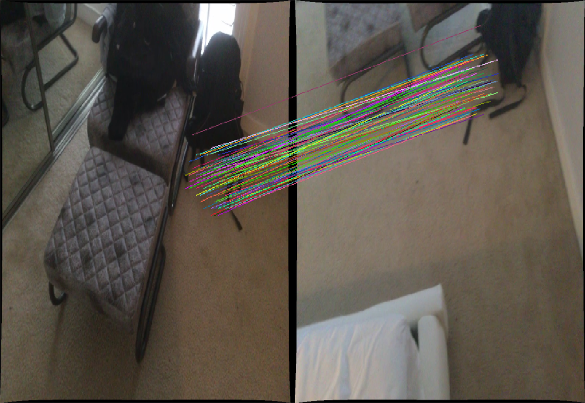
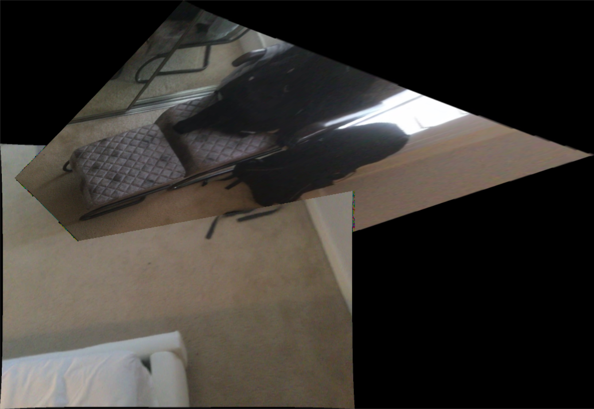

# LoFTR-Stitch
应该是目前Github效果最好的**通过深度学习**进行特征提取匹配的图像拼接应用

## WHY
* 一般而言，进行图像拼接都是采用数字图像处理方法，在进行图像特征提取和匹配这一阶段时，通常采用SIFT、ORB、Harris等传统算法已经能起到还算让人满意的效果，但这些数字图像处理算法仅仅从像素值变化的角度，通过检测*角点*、*斑点*来提取特征，假如图像运动模糊，或者低纹理，那么可能就提取不到太多有效特征点，在进行单应性矩阵计算时就会有误差，拼接就难以取得满意的效果。而深度学习却可以提取出**维度更高**的特征点，在上述的情况下，通过深度学习进行特征提取匹配则具有较高鲁棒性。

## How to start
1. 环境安装:
```shell
conda env create -f environment.yaml
conda activate loftr
```
2. 运行:
```shell
python inference.py
```

## 效果


可以看出，通过深度学习进行特征提取匹配在低纹理的地毯上也能提取出数量较多的特征点，在前后两幅图像视角相差很大时，也能还原出原场景

## LoFTR
项目基于2021CVPR论文，详情参考paper目录下论文原文
